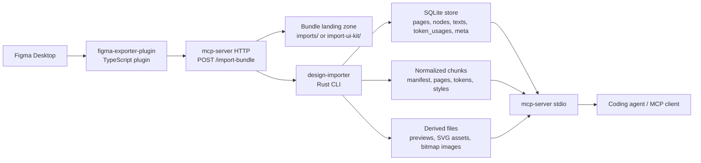

# Architecture

Local Figma Port is a local-first pipeline that converts a narrow slice of a Figma document into a queryable design context for coding agents.

At a high level, the system does four things:

1. Export a scoped design bundle from Figma.
2. Normalize that bundle into a stable intermediate representation and SQLite store.
3. Expose bounded tools and resources over MCP.
4. Help agents traverse the exported scope without guessing.

## System Overview

## Design Goals

- Keep the exported scope intentionally narrow instead of sending a whole Figma file.
- Normalize raw plugin output into a stable, LLM-friendly shape before any agent reads it.
- Prefer bounded reads and targeted tools over whole-page payloads.
- Preserve enough layout, style, asset, and traversal metadata so agents can continue deterministically.
- Keep the pipeline local. The agent does not talk to Figma directly.

## Main Components

### 1. Figma exporter plugin

Path: `packages/figma-exporter-plugin`

Responsibilities:

- Runs inside Figma Desktop.
- Exports a selected scope in `plugin-export.v1`.
- Supports two modes:
  - `Design element`
  - `UI-kit`
- Captures node trees, layout metadata, styles, variable refs, and optional previews/assets.
- Attempts immediate delivery to the local server through `POST /import-bundle`.
- Falls back to a downloadable bundle if the local endpoint is unavailable.

Key implementation points:

- Entry point: `src/main.ts`
- Export logic: `src/export/*`
- UI panel: `src/ui.html`
- Build output: `dist/main.js`

### 2. Design importer

Path: `packages/design-importer`

Responsibilities:

- Validates incoming plugin data against `schemas/plugin-export.v1.schema.json`.
- Normalizes raw export data into `design-ir.v1`.
- Computes derived layout information such as spacing.
- Writes normalized data to SQLite and gzip-compressed chunks.
- Imports optional UI-kit snapshots and creates node-to-component mappings.
- Performs incremental imports using `meta.page_hash:{pageId}` keys.

Key implementation points:

- Entry point: `src/main.rs`
- Main command: `design-importer import`
- Schema dependencies:
  - `schemas/plugin-export.v1.schema.json`
  - `schemas/design-ir.v1.schema.json`
  - `sql/design_store.v1.sql`

### 3. MCP server

Path: `packages/mcp-server`

Responsibilities:

- Serves imported design data as MCP tools and resources.
- Validates tool inputs and outputs against `schemas/mcp-tools.v1.schema.json`.
- Provides two runtime modes:
  - HTTP server for health checks, resources, tool calls, and bundle ingestion
  - stdio JSON-RPC server for MCP clients
- Resolves previews, selections, SVG assets, bitmap images, and UI-kit mappings from local storage.

Key implementation points:

- HTTP entry: `src/index.ts`
- MCP stdio entry: `src/mcp-stdio.ts`
- Resource handlers: `src/resources/handlers.ts`
- SQLite query helpers: `src/db.ts`
- Tool implementations: `src/tools/*`

### 4. Repository skill and docs

Paths:

- `SKILL.md`
- `docs/*`

Responsibilities:

- Teach agents how to use the exported scope correctly.
- Reinforce important traversal rules such as instance resolution and coverage boundaries.
- Document normalization rules, MCP resources, CLI behavior, and data flow.

This layer is not part of the import/query runtime, but it is part of the system architecture because agent behavior depends on it.

## Data Contracts

These files are the main architectural contracts:

- `schemas/plugin-export.v1.schema.json`
  - shape produced by the Figma plugin
- `schemas/design-ir.v1.schema.json`
  - normalized intermediate representation written by the importer
- `schemas/mcp-tools.v1.schema.json`
  - MCP tool IO contract
- `sql/design_store.v1.sql`
  - persisted relational schema

The expected direction of transformation is:

`plugin-export.v1` -> `design-ir.v1` -> SQLite tables + local MCP responses

## Storage Model

Runtime paths are configurable through environment variables, but the architecture is organized around these logical areas:

### Landing zones

- `imports/`
  - latest design-element bundle payload
- `import-ui-kit/`
  - latest UI-kit bundle payload

The HTTP server writes bundle JSON here before invoking the importer.

### Persistent query store

- `data/design_store.sqlite`

Important tables:

- `meta`
  - manifests, import metadata, indexes, page hashes
- `pages`
  - imported page list
- `nodes`
  - normalized node graph and JSON payload columns
- `edges`
  - child ordering
- `texts`
  - extracted text nodes for search
- `token_usages`
  - token-to-node reference table
- `uikit_*`
  - optional UI-kit snapshot and mapping tables
- `fts_nodes`, `fts_texts`
  - full-text search indexes

### File-based artifacts

- `data/chunks/`
  - normalized gzip JSON artifacts such as page chunks, manifest, tokens, styles
- `data/previews/`
  - preview PNGs
- `data/assets/svg/`
  - exported SVG assets
- `data/assets/images/`
  - exported bitmap assets

The file artifacts complement SQLite. SQLite is optimized for targeted queries; chunks and raw assets preserve bounded snapshots and binary payloads.

## End-to-End Flows

### Design element import flow

1. A user selects a narrow scope in Figma.
2. The plugin exports `plugin-export.v1` artifacts.
3. The plugin posts the bundle to `POST /import-bundle`.
4. The HTTP server writes `plugin-export.bundle.json` into `imports/`.
5. The HTTP server runs `design-importer import`.
6. The importer validates, normalizes, and writes:
   - SQLite rows
   - gzip chunks
   - previews/assets/images
7. MCP tools and resources immediately serve the updated local state.

### UI-kit import flow

1. The plugin exports in `UI-kit` mode.
2. The bundle lands in `import-ui-kit/`.
3. The importer writes `uikit_pages`, `uikit_components`, `uikit_tokens_raw`, `uikit_styles_raw`.
4. The importer builds `uikit_component_usages` mappings using strategies such as `direct_id`, `name`, and `alias`.
5. MCP resources expose the imported UI-kit snapshot and mappings.

### Agent query flow

Typical agent path:

1. Resolve the intended scope:
   - `resolve_target` when the user describes UI in natural language
   - `list_pages` or `list_frames` when the target is already known
2. Read the relevant node:
   - `get_node`
   - `resolve_instance` when `inspectionHints.requiresInstanceResolution = true`
3. Analyze layout:
   - `layout_report`
4. Pull only the needed context:
   - `get_context_bundle`
5. Read linked resources only when necessary:
   - previews
   - selections
   - SVG assets
   - bitmap images
   - UI-kit mappings

The architecture is intentionally designed so agents do not need to read a whole design dump.

## Runtime Modes

### HTTP mode

Implemented in `packages/mcp-server/src/index.ts`.

Used for:

- `GET /healthz`
- `GET /tools`
- `GET /resource?uri=...`
- `POST /tools/{tool_name}`
- `POST /import-bundle`

This mode is the bridge between the plugin and the importer. It also provides a simple local debugging surface.

### MCP stdio mode

Implemented in `packages/mcp-server/src/mcp-stdio.ts`.

Used for:

- MCP JSON-RPC communication with coding agents
- resource listing/reading
- tool listing/calling

This is the richer agent-facing mode. In practice, stdio exposes the workflow-oriented tools used by MCP clients, including `resolve_target` and `build_coverage_checklist`.

## Query Philosophy

The repository is optimized around a few architectural rules:

- Tools first, resources second.
- Narrow scope before deep traversal.
- One-level child expansion by default.
- Explicit instance resolution instead of silently expanding masters.
- Preserve both references and resolved style payloads.
- Derive helpful node-linked resources without overwriting explicit plugin data.
- Stop when coverage is ambiguous instead of inventing missing UI.

These rules are captured in:

- `docs/NORMALIZATION.md`
- `docs/MCP_RESOURCES.md`
- `SKILL.md`

## Incremental Import Model

Incremental behavior is important for large design files.

- Each page carries a hash in the plugin manifest.
- The importer stores the last imported hash in `meta` as `page_hash:{pageId}`.
- If the hash is unchanged and incremental mode is enabled, the page is skipped.
- Manifest metadata still gets refreshed, and failed pages are recorded separately.

This keeps imports fast while preserving stable query behavior for agents.

## Why SQLite Plus Chunks

The project intentionally keeps both relational and file-based outputs:

- SQLite supports search, joins, FTS, and targeted node reads.
- Gzip chunks preserve page-shaped snapshots and raw-ish structured artifacts.
- Local files are better for previews and binary assets.

This split reduces the amount of work each subsystem needs to do:

- importer writes normalized truth once
- MCP server chooses the cheapest serving path per request
- agents read only the smallest useful payload

## Contributor Map

When making changes, this is the quickest way to find the right layer:

- Export shape changed in Figma:
  - start in `packages/figma-exporter-plugin/src/export/*`
  - then update `schemas/plugin-export.v1.schema.json`
- Normalization rules changed:
  - start in `packages/design-importer/src/main.rs`
  - then update `docs/NORMALIZATION.md`
  - update `schemas/design-ir.v1.schema.json` if the output contract changed
- Storage/query behavior changed:
  - update `sql/design_store.v1.sql`
  - update importer writes and MCP reads together
- New MCP tool or resource:
  - add implementation under `packages/mcp-server/src/tools/*` or `src/resources/*`
  - wire it into `src/mcp-stdio.ts`
  - update `schemas/mcp-tools.v1.schema.json`
- Runtime/install behavior changed:
  - check `scripts/install/*`, `scripts/runtime/*`, `scripts/verify/*`, `scripts/uninstall/*`, and `scripts/lib/local_figma_port_state.sh`

## Related Documents

- `docs/README.md`
- `README.md`
- `docs/DATAFLOW.md`
- `docs/NORMALIZATION.md`
- `docs/MCP_RESOURCES.md`
- `docs/IMPORTER_CLI.md`
- `docs/repo_structure.md`
