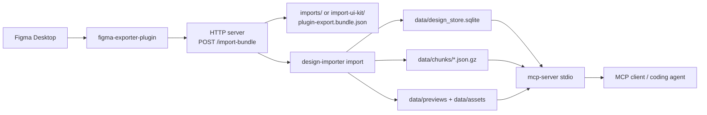

# Data Flow

This document focuses on how data moves through the Local Figma Port runtime.

For a broader system overview, see [../ARCHITECTURE.md](../ARCHITECTURE.md).

## High-Level Flow

## Import Flow

### Design element flow

1. A user selects a narrow design scope in Figma.
2. The plugin exports a `plugin-export.v1` bundle.
3. The plugin sends the bundle to `POST /import-bundle`.
4. The HTTP server saves the bundle to `imports/plugin-export.bundle.json`.
5. The HTTP server runs `design-importer import`.
6. The importer materializes bundle contents if needed, validates them, normalizes them, and writes:
   - `data/design_store.sqlite`
   - `data/chunks/*.json.gz`
   - `data/previews/*`
   - `data/assets/svg/*`
   - `data/assets/images/*`
7. Updated tools and resources become available immediately to MCP clients.

### UI-kit flow

The flow is the same, but the bundle lands in `import-ui-kit/` and the importer additionally populates `uikit_*` tables and derived mappings.

## Runtime Split

### HTTP server

The HTTP runtime is used for:

- health checks
- bundle ingestion
- local debugging of tools/resources

It is implemented in `packages/mcp-server/src/index.ts`.

### MCP stdio server

The stdio runtime is the main agent-facing surface.

It is implemented in `packages/mcp-server/src/mcp-stdio.ts` and exposes:

- navigation tools such as `list_pages`, `list_frames`, `get_node`
- search tools such as `search_nodes`, `search_text`, `find_by_token`
- analysis tools such as `layout_report`
- workflow tools such as `resolve_target`, `build_coverage_checklist`, `resolve_instance`
- bounded context packaging via `get_context_bundle`

## Query Flow

Typical agent workflow:

1. Resolve the target scope.
2. Read only the relevant node or selection.
3. Follow `inspectionHints` instead of guessing.
4. Pull linked resources only when needed.
5. Keep context bounded with tool calls instead of reading whole exports.

Typical call sequence:

1. `resolve_target(...)`
2. `build_coverage_checklist(...)`
3. `get_node(...)`
4. `layout_report(...)`
5. `get_context_bundle(...)`

## Storage Flow

The importer writes both relational and file-based artifacts:

- SQLite for targeted reads, joins, and FTS
- gzip chunks for page-shaped normalized snapshots
- local preview and asset files for binary resources

Important metadata written during import includes:

- `project_manifest`
- `selections_index`
- `assets_index`
- `image_assets_index`
- `page_hash:{pageId}`

## Incremental Updates

Each page in the plugin manifest carries a hash.

During import:

1. the importer reads the last imported hash from `meta`
2. unchanged pages are skipped when incremental mode is enabled
3. changed pages are reprocessed and their hash is updated

This keeps local refreshes fast even when the source Figma file is large.
